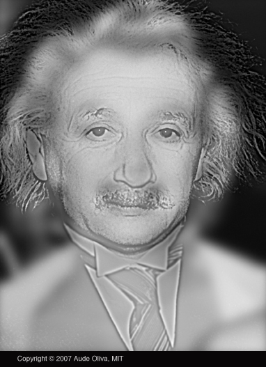

# To Distinguish wheather is Marilyn Monroe or Albert Einstein 
Two models, an ordinary convlution neural networks and a pre-trained VGG net  were trained to recognize who she/he really is. 

## Result
Both models tend to believe that the person in the figure is more likely to be Albert Einstein.
## Reference
[1] MIT hybrid image gallery http://olivalab.mit.edu/hybrid_gallery/gallery.html  
[2] Chollet, Francois. Deep learning with Python. Simon and Schuster, 2021.
